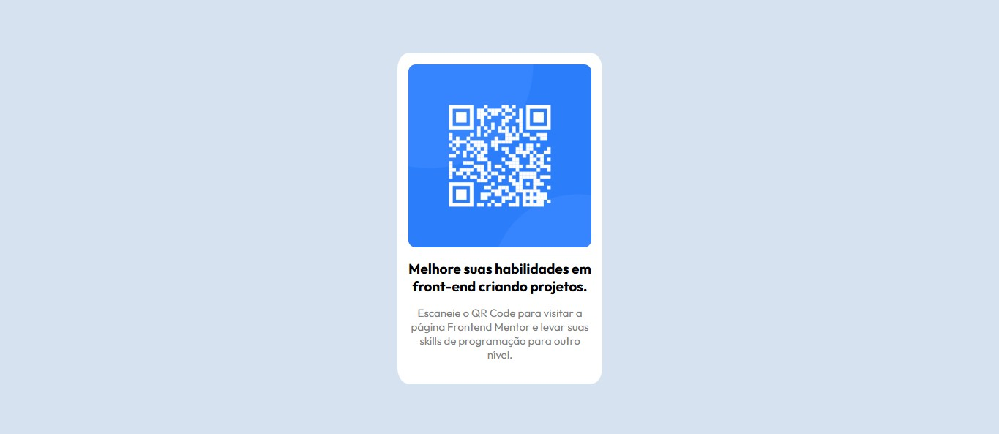

# Frontend Mentor - QR code component solution

Nesse primeiro challenge foi usado somente HTML e CSS pra criar uma página com um QR Code que leva até a página do FrontEnd Mentor. 

Essa parte foi fácil, já conhecia HTML e CSS e só tive uma pequena ajuda com a parte do flexbox que já não tava mais habituada a usar por não estar praticando. Sempre bom fazer coisas simples para relembrar o básico.

### Screenshot

### Links

- Solution URL: [Add solution URL here](https://your-solution-url.com)
- Live Site URL: [Add live site URL here](https://your-live-site-url.com)
